# 指标Metric
### perplexity
困惑度(Perplexity, PPL)是一种用来评价语言模型好坏的指标。直观上理解，当我们给定一段**非常标准的，高质量的，符合人类自然语言习惯的文档作为测试集**时，模型生成这段文本的概率越高，就认为模型的困惑度越小，模型也就越好。

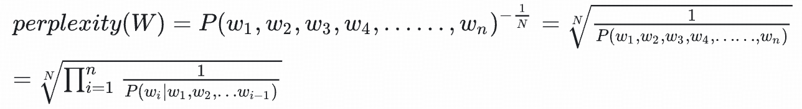

**困惑度的定义**，最后的值越小，模型越好。


模型A: log2PA=log2(0.16∗0.30∗0.30∗0.50∗0.30∗0.35∗0.60∗0.70)=−11.62

模型B: log2PB=log2(0.16∗0.50∗0.40∗0.60∗0.40∗0.40∗0.60∗0.70)=−9.59

也可以对概率连乘后取对数。可以看到 log2PA<log2PB ，这说明模型B生成这句话的概率更高。

这个结果我们可以理解为模型B可能是一个作家，相对更容易写出这样的句子，模型A是一个小学生，很难写出这样的句子。所以在这个测试集下B比A好。


困惑度的计算，其实依赖于语言模型输出token的概率分布，因此在比较语言模型时，其实是在比较哪个分布更符合测试集的真实概率分布。对测试集困惑度越小的模型，交叉熵也会越小。都是针对ground true和预测分布进行计算的。

计算困惑度，由于所有模型都只能接受有限长的序列。因此可以采用等长切分或者滑动窗口的方式决定上下文。

# 词袋模型
word2vec

c-bow skip-gram


# 方差和偏差对训练的影响，对稳定性的影响
# LSTM RNN CNN


# Transformer
为什么sdpa需要除以根号dk？

原始的q和k都是方差为1，均值为0 的值，由于q和k内积随着维度的增大而增大，导致方差上升。这会导致在softmax中的值变得过大。因此通过除以根号dk，使其方差恢复为1，使softmax处理后的概率值变得平缓一些。防止某些值过大导致梯度爆炸。


### softmax函数
```plain
def softmax(x):
    exp_x = np.exp(x)
    return exp_x / np.sum(exp_x)

# 防nan版
def softmax(x):
    shift_x = x - np.max(x)
    exp_x = np.exp(shift_x)
    return exp_x / np.sum(exp_x)
```

<u>为什么需要用e为底数？</u>

之所以要选用e作为底数的指数函数来转换概率，是因为上一层的输出有正有负，采用指数函数可以将其第一步都变成大于0的值，然后再算概率分布。


<u>如果ai太大，e的ai次方会导致nan</u>

一种简单有效避免该问题的方法就是让exp(x)中的x值不要那么大或那么小，在softmax函数的分式上下分别乘以一个非零常数：

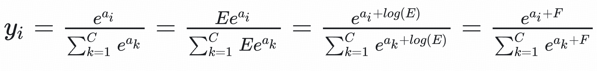

考虑怎么选取常数F。我们的想法是让所有的输入在0附近，这样eai的值不会太大，所以可以让F的值为：

**F = -max(a1, a2, ...., an)**

这样子将所有的输入平移到0附近（当然需要假设所有输入之间的数值上较为接近），同时，除了最大值，其他输入值都被平移成负数，e为底的指数函数，越小越接近0，这种方式比得到nan的结果更好。


### 最大似然估计(maximum likelihood evaluation, MLE)
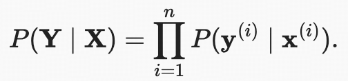

xi是输入，yi是ground true。因此这里计算的是分类问题中每个输入对应ground true的概率的连乘（即每个样本都计算正确的概率的连乘）。最后结果越大越好。

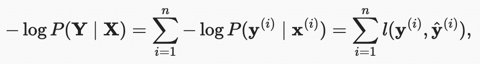

### 负对数似然损失
最大似然估计等于最小负对数似然

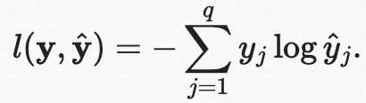

y是ground true，y-hat是预测值。**负对数似然损失**通常被称为**交叉熵损失（cross-entropy loss）**。 由于y是一个长度为q的独热编码向量， 所以除了一个项以外的所有项j都消失了。 由于所有y^j都是预测的概率，所以它们的对数永远不会大于0。 因此，如果正确地预测实际标签，即如果实际标签P(y∣x)=1， 则损失函数不能进一步最小化。


### 熵
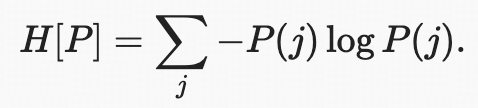

熵是信息论中衡量随机变量不确定性的指标，表示一个概率分布的混乱程度。熵越高，不确定性越大。


### KL散度，相对熵(Kullback-Leibler Divergence)
### k1，k2，k3


**<u>KL 散度衡量从分布 Q 到分布 P 的信息损失</u>**

### 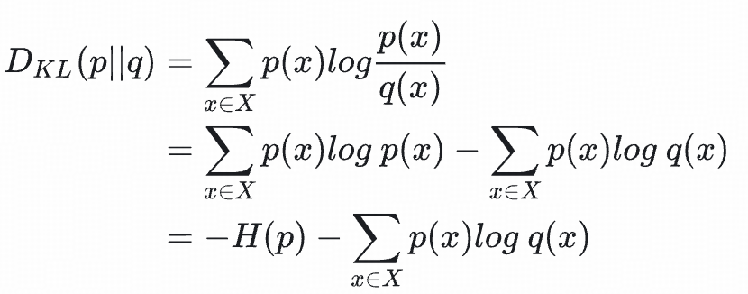
这里H(p)是p的熵

+ 当真实分布 P 为确定性分布（如独热编码）时，H(P)=0，此时交叉熵损失等价于KL散度。
+ 在模型优化中，最小化交叉熵损失等价于最小化预测分布与真实分布的KL散度。

H(p)表示自身的原始的信息量，减去H(p,q)等于原本的基础上损失的信息量。

KL散度可以被定义为两个概率分布之间的交叉熵与真实分布的熵的差值

### 交叉熵(针对KL散度的进化)
衡量两个概率分布 _P_（真实分布）和 _Q_（预测分布）之间的差异。

**当p是ont-hot编码时，退化为仅优化模型对正确类别的预测概率。**

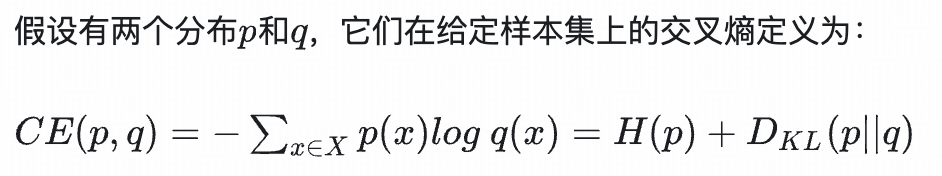


### 总结交叉熵与KL散度在应用上的区别
+ **交叉熵损失的应用**：  
主要用于监督学习中的分类任务（如 SFT），目标是直接最小化模型预测与标签之间的差异。由于标签通常是确定性的（one-hot），交叉熵直接优化模型对正确类别的置信度。
+ **KL 散度的应用**：  
常见于以下场景：
    - **模型蒸馏**：让学生模型的输出分布 Q 匹配教师模型的分布 P，使用 KL(P∥Q)。
    - **强化学习（如 PPO）**：约束新旧策略的差异（KL(Pold∥Pnew)），防止策略突变。
    - **生成模型**：衡量生成分布与真实分布的距离（如变分推断中 KL(Q∥P)）。


# Bert
Bert在预训练时的任务是nsp和完词填空

## Robert相比Bert的改进
1. 训练数据与规模扩大  
数据量增加 ：RoBERTa使用了更大的预训练数据集（约160GB），远超BERT的原始数据量，从而提升模型对多样化文本的适应能力 。  
训练时间与参数优化 ：通过更长的训练周期、更大的批量大小（batch size）和动态调整的学习率，使模型收敛更充分 。
2. 训练策略改进  
**动态掩码（Dynamic Masking）**：BERT在预处理时对文本进行静态掩码（固定掩码位置），而RoBERTa在每次输入时动态生成掩码，增强模型对不同掩码模式的鲁棒性 。  
**移除NSP任务 **：RoBERTa取消了BERT中的下一句预测（Next Sentence Prediction, NSP）任务，专注于优化掩码语言模型（MLM），简化训练目标 。
3. 模型细节优化  
优化函数调整 ：改进优化器的超参数（如学习率调度策略），并采用更高效的训练技巧（如**混合精度训练**），提升训练效率和模型性能 。
4. 性能表现  
通过上述改进，RoBERTa在多项下游任务（如GLUE基准）中超越BERT，验证了其优化策略的有效性 。  
总结 ：RoBERTa通过“**数据量扩展+动态掩码+训练策略简化**”三大核心改进，在保持BERT架构的基础上显著提升性能，体现了预训练模型对数据和训练细节的敏感性 。

# Peft
## LoRA及其变体
lora初始化方式

deepseek v3moe结构

微调  防止只在专用领域专用，通用能力不行方法

+ adaLoRA


+ rsLoRA


+ QLoRA


## Prompt Tuning
Prefix Tuning==P-Tuning-v2

Prompt Tuning==P-Tuning-v1

Prefix tuning相比prompt tuning，其不只是在embedding前加入soft token，在每一层中都加入了soft token，增大了参数量，但依然占很少的参数量。


# MoE模型架构
## Mixtral


## QWQ


## Deepseek


# 混合精度
## 各种精度的比较


## 混合精度训练


# 优化器(Optimizer)
## SGD

## Adam


# RLHF
### 马尔可夫链MDP
最优策略为在所有状态下的状态价值函数大于其他任何策略的状态价值


## Rewar Model
### PRM(Process Reward Model)


### ORM(Output Reward Model)
**OpenRLHF**

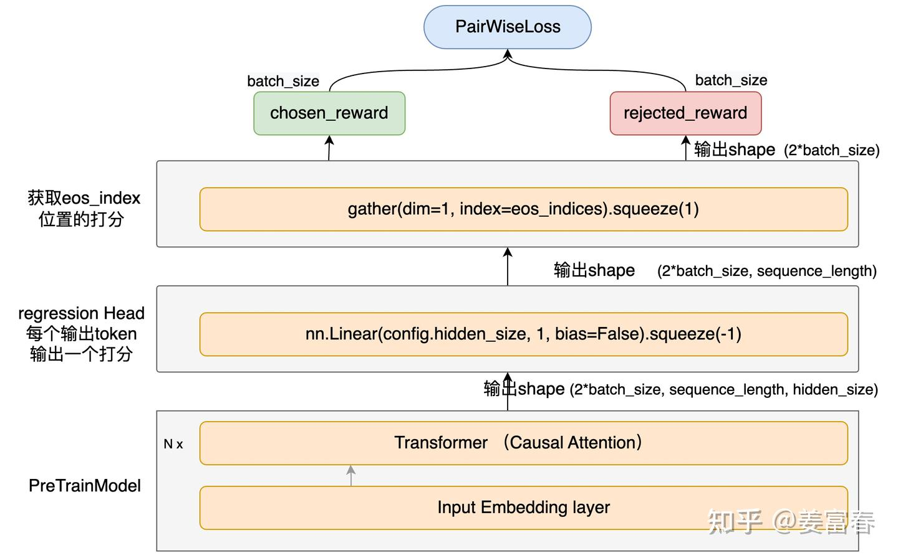


奖励模型的Loss Function。**PairWiseLoss有个良好的属性：自带margin效果**。因为在0附近也会产生一定的loss，来更新模型，拉大正负例的差距。

```plain
class PairWiseLoss(nn.Module):
    """
    Pairwise Loss for Reward Model
    """
    def forward(self, chosen_reward, reject_reward, margin):
        if margin is not None:
            loss = -F.logsigmoid(chosen_reward - reject_reward - margin)
        else:
            loss = -F.logsigmoid(chosen_reward - reject_reward)
        return loss.mean()


class LogExpLoss(nn.Module):
    """
    Pairwise Loss for Reward Model
    Details: https://arxiv.org/abs/2204.05862
    """
    def forward(self, chosen_reward, reject_reward, margin):
        loss = torch.log(1 + torch.exp(reject_reward - chosen_reward)).mean()
        return loss
```

**-logsigmoid曲线图**  
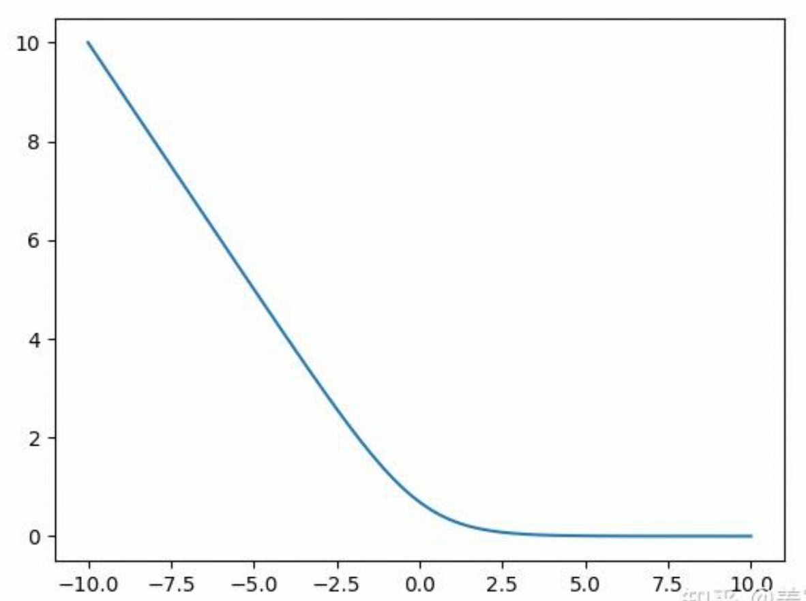

当 chosen_reward−reject_reward<0 时loss急剧上升，表示正例样本的得分小于负例样本的得分，产出较大的loss， 回传产生较大梯度更新模型。当 chosen_reward−reject_reward>0 loss基本趋近于0，表示正例得分大于负例的得分是合理的，不产生loss。


## PPO
### 四个模型
Actor Model, Reference Model, Reward Model, Critic Model

PPO中的Reward Model是ORM，对一整个句子最后的eos输出的得分。

Critic Model是针对每一个step的状态进行打分，即对当前token到最后eos的预估价值

### 重要性采样
重采样是对旧策略进行一次采样的旧数据上进行多次的更新。这里同一个batch的数据会被使用n次，而这里需要主要的是，当完成了一个epoch的迭代后，会将新的策略作为旧策略，并且在该策略上重新进行采样。但是通常仅使用一份数据，然后使用kl div 或者clip来限制policy model的更新幅度。


**为什么需要重新进行采样？**

policy model更新越来越多之后，新旧策略差距会变得越来越大，这时候重要性采样的作用并不大了。新旧策略差异变大时，重要性采样的有效性会下降。因此需要使用kl div 或者 clip进行约束


#### 总结
+ **旧数据复用**: 在单次迭代内，PPO允许通过重要性采样多次利用旧策略数据，提升效率
+ **重新采样的触发条件**: 策略更新次数超过阈值（如一次迭代结束）。
    - 新旧策略差异过大，导致重要性采样权重方差失控.

**核心结论**：PPO通过有限复用旧数据平衡效率与稳定性，但必须定期重新采样以确保数据与当前策略分布一致


#### Clip与KL散度的关联
+ **Clip**：通过截断概率比率实现硬性约束，直接限制策略更新幅度，提升训练稳定性
+ **KL散度**：通过衡量分布差异实现软性约束，间接控制策略更新步伐，防止分布漂移
+ **核心区别 **：Clip是PPO-Clip的核心机制，而KL散度常用于PPO-Penalty变体，两者均服务于策略更新的稳定性15
+ **互补性 **：
    - **Clip **通过硬性截断直接限制概率比率，实现简单高效16。
    - **KL散度 **通过软性惩罚间接约束分布差异，适应复杂任务需求59。
+ **共同目标 **：  
两者均用于**平衡策略更新的激进性与稳定性 **，防止新策略过度偏离旧策略15。


### 优势函数
#### 广义优势估计（GAE）
[https://zhuanlan.zhihu.com/p/577598804](https://zhuanlan.zhihu.com/p/577598804)

[https://zhuanlan.zhihu.com/p/10343932079](https://zhuanlan.zhihu.com/p/10343932079)

上面的 AE 算法采用 [<font style="color:rgb(9, 64, 142);">one-step TD](https://zhida.zhihu.com/search?content_id=216488654&content_type=Article&match_order=1&q=one-step+TD&zhida_source=entity) 来描述 advantage，我们都知道 TD 算法虽然会减小方差，但是也增大了偏差，所以这就像两个极端，MC 方差最大，one-step TD 偏差最大，有没有一种方法，可以提供一种 trade-off，而且可以很方便的调节这种 trade-off 呢？


**蒙特卡洛方法**是估计优势函数的一种方式。蒙特卡洛方法通过对完整的轨迹进行采样，计算实际的回报来估计价值函数。利用从状态 s 到回合结束的总回报来估计 Q(s,a)，其中，R(s,a)是从状态 _s_ 采取动作 _a_ 后获得的实际总回报。然后再用：A(s,a)=R(s,a)−V(s)


优点：可以得到一个无偏的优势估计。

缺点：它依赖于回合的完整性，只有在整个回合结束后才能得到估计结果，因此不能用于在线场景。它的方差较大，因为单次采样可能会受到偶然因素的影响，因此估计结果可能不稳定。


**时序差分**是一种利用一步预测来估计价值函数的方式。时序差分法通过结合当前时刻的估计值和下一个状态的估计值来更新当前的价值估计。并且使用rt+γVst+1作为值函数V(st)的估计量。对优势函数的估计可以用以下公式表示：A(s,a)=rt+γV(st+1)−V(st)

其中，r是当前状态 s采取动作 a 所得到的即时奖励，γ是折扣因子，而 V(st+1)是下一状态 的价值。


优点：它可以在不需要等待整个回合结束的情况下进行更新，因此适合在线学习。其次，它的估计结果方差较小，因为它依赖于多个小步的估计，平滑了每一步的波动。

缺点：它虽然降低了方差，但由于使用了估计的价值来更新，可能会引入一些偏差。因此，如何在偏差和方差之间进行权衡，是估计价值函数时需要考虑的问题。

  
  


## DPO


## KTO


## GRPO


## DAPO


# 分布式训练
## Deepspeed


## Megatron


## DP数据并行


## PP PipelineLine并行


## EP专家并行moe


## TP张量并行


# Attention
## Flash Attention


## SA(自注意力)
QKV允许模型在不同的表示空间中学习和抽取特征。这样做增加了模型的灵活性和表达能力，允许模型分别优化用于匹配(Q 和K)和用于输出信息合成(V)的表示。
> 根号dk的作用是防止运算后得到的内积差异过大，导致softmax运算出问题。

如果不进行缩放，当较大时，点积的结果可能会变得非常大，这会导致在应用softmax函数时产生的梯度非常小。因为softmax函数是通过指数函数计算的，大的输入值会使得部分输出接近于1，而其他接近于0，从而导致梯度消失，这会在反向传播过程中造成梯度非常小，使得学习变得非常缓慢。这样，softmax的输入在一个合适的范围内，有助于避免极端的指数运算结果，从而保持数值稳定性和更有效的梯度流。这个操作确保了即使dk(向量维度)在很大的情况下， 注意力机制也能稳定并有效地学习。

```python
import torch
import torch.nn as nn
import torch.nn.functional as F


class SelfAttention(nn.Module):
    def __init__(self, seq_length):
        super(SelfAttention, self).__init__()
        self.input_size = seq_length
        # 定义三个权重矩阵:Wq、Wk、Wv
        self.Wq = nn.Linear(seq_length, seq_length)  # 线性变换
        self.Wk = nn.Linear(seq_length, seq_length)
        self.Wv = nn.Linear(seq_length, seq_length)

    def forward(self, input):
        # 计算Q,K,V 三个矩阵
        q = self.Wq(input)
        k = self.Wk(input)
        v = self.Wv(input)

        # 计算QK^T，即向量之间的相关度
        attention_scores = torch.matmul(q, k.transpose(-1, -2)) / torch.sqrt(torch.tensor(float(self.input_size)))
        # 计算向量权重，softmax归一化
        attention_weight = F.softmax(attention_scores, dim=-1)
        # 计算输出
        output = torch.matmul(attention_weight, v)
        return output


x = torch.randn(2, 3, 4)
Self_Attention = SelfAttention(4)  # 传入输入向量的维度
output = Self_Attention(x)
print(output.shape)
```

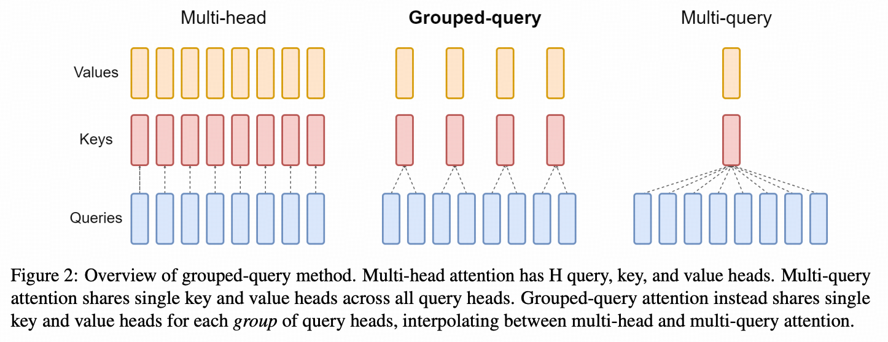


## MHA(多头注意力)
从代码直观理解，MHA相比SA的改进是，将dim修改为(num_head, head_dim)维度后，交换维度变为(bs, num_head, seq_len, head_dim)。每个头中的计算与原本的sa没有区别，每个头内(q*k) * v之后的维度为head_dim。最后再次交换维度为(bs, seq_len, num_head, head_dim) -> (bs, seq_len, num_head * head_dim)

- 维度变化
q.dim == k.dim == v.dim == (bs, seq_len, hidden_dim)
-> q.dim == k.dim == v.dim == (bs, num_head, seq_len, head_dim)
-> (q * k^T).dim == attn_weight.dim == (bs, num_head, seq_len, seq_len)
-> (attn_weight * v).dim == output.dim == (bs, num_head, seq_len, head_dim)
-> <u>transpose&concat</u> final_output.dim == (bs, seq_len, hidden_dim)

**RQ1:MHA在带宽，显存开销，时间复杂度方面与SA的区别**
todo


```python
import torch
import torch.nn as nn

class MultiHeadAttention(nn.Module):
    def __init__(self, embed_dim, num_heads):
        super(MultiHeadAttention, self).__init__()
        self.num_heads = num_heads
        self.head_dim = embed_dim // num_heads
        self.wq = nn.Linear(embed_dim, embed_dim)
        self.wk = nn.Linear(embed_dim, embed_dim)
        self.wv = nn.Linear(embed_dim, embed_dim)
        self.wo = nn.Linear(embed_dim, embed_dim)

    def mh_split(self, hidden):
        batch_size = hidden.shape[0]
        x = hidden.view(batch_size, -1, self.num_heads, self.head_dim).transpose(1, 2)
        return x

    def forward(self, hidden_states, mask=None):
        batch_size = hidden_states.size(0)

        # 线性变换
        q, k, v = self.wq(hidden_states), self.wk(hidden_states), self.wv(hidden_states)

        # 多头切分
        q, k, v = self.mh_split(q), self.mh_split(k), self.mh_split(v)

        # 注意力计算
        scores = torch.matmul(q, k.transpose(-2, -1)) / torch.sqrt(torch.tensor(self.head_dim, dtype=torch.float32))
        if mask is not None:
            scores = scores.masked_fill(mask == 0, float('-inf'))
        attention = torch.softmax(scores, dim=-1)
        output = torch.matmul(attention, v)

        # 拼接多头
        output = output.transpose(1, 2).contiguous().view(batch_size, -1, self.num_heads * self.head_dim)

        # 线性变换
        output = self.wo(output)

        return output

x = torch.rand(2, 3, 36)
print(x)
output = MultiHeadAttention(36, 6)
y = output(x)
print(y.shape)
```


## MQA(多查询注意力)
MQA让所有的Head之间共享同样的一份 K 和 V 矩阵（意味K和V的计算唯一），只让 Q 保留了原始多头的性质（每个Head存在不同的转换），从而大大减少 K 和 V 矩阵的参数量以及KV Cache的显存占用，以此来达到提升推理速度，但是会带来精度上的损失。MQA被大量应用于LLM中，如ChatGLM2。

**如何将现有的预训练多头注意力模型转换为多查询注意力模型 (MQA)？从现有的多头模型创建多查询注意力模型涉及两个步骤：模型结构的转换和随后的预训练。**
- 模型结构的转换：此步骤将多头模型的结构转换为多查询模型。它是通过将原始模型的多个头的键和值的投影矩阵（线性层）合并（均值池化）为键和值的单个投影矩阵来实现的。这种均值池化方法被发现比选择现有键和值头之一或从头开始初始化新的键和值头更有效。生成的结构具有合并的键和值投影，这是多查询模型的特征。
- 对转换后的模型进行预训练：结构转换后，模型将接受额外的训练。此训练不像原始模型训练那样广泛；它只是原始模型训练步骤的一小部分（表示为 α）。此预训练阶段的目的是让模型根据其新的简化注意力机制调整和优化其性能。训练遵循与原始相同的方法，确保学习动态的一致性。

wq, wk, wv中，wk和wv都是直接将hidden_dim转化为head_dim。之后split_head的时候，k和v并不分裂，在原来基础上加入num_head为1这个维度。后续计算时，不同head的q都要和同一个k和v进行计算。因为计算的时候是广播，所以k和v的head这里会广播到num_head一样的数量。

```python
import torch
import torch.nn as nn


class MultiQuerySelfAttention(nn.Module):
    def __init__(self, embed_dim, num_heads):
        super(MultiQuerySelfAttention, self).__init__()
        self.num_heads = num_heads
        self.head_dim = embed_dim // num_heads

        self.wq = nn.Linear(embed_dim, embed_dim)

        # MHA
        # self.wk = nn.Linear(embed_dim, embed_dim)
        # self.wv = nn.Linear(embed_dim, embed_dim)

        # MQA
        self.wk = nn.Linear(embed_dim, self.head_dim)
        self.wv = nn.Linear(embed_dim, self.head_dim)
        self.wo = nn.Linear(embed_dim, embed_dim)

    def q_h_split(self, hidden, head_num=None):
        batch_size, seq_len = hidden.size()[:2]
        # q拆分多头
        if head_num == None:
            x = hidden.view(batch_size, seq_len, self.num_heads, self.head_dim).transpose(1, 2)
            return x
        else:
            # 这是MQA: 需要拆分k和v,这里面的head_num =1 的
            # 最终返回维度(batch_size, 1, seq_len, head_dim)
            return hidden.view(batch_size, seq_len, head_num, self.head_dim).transpose(1, 2)

    def forward(self, hidden_states, mask=None):
        batch_size = hidden_states.size(0)

        # 线性变换
        q, k, v = self.wq(hidden_states), self.wk(hidden_states), self.wv(hidden_states)

        # 多头切分
        # 这是MHA的
        # q, k ,v  = self.split(q), self.split(k), self.split(v)
        # 这是MQA的
        q, k, v = self.q_h_split(q), self.q_h_split(k, 1), self.q_h_split(v, 1)

        # 注意力计算
        scores = torch.matmul(q, k.transpose(-2, -1)) / torch.sqrt(torch.tensor(self.head_dim, dtype=torch.float32))
        print("scores:", scores.shape)
        if mask is not None:
            scores = scores.masked_fill(mask == 0, float('-inf'))
        attention = torch.softmax(scores, dim=-1)
        output = torch.matmul(attention, v)

        # 多头合并
        output = output.transpose(1, 2).contiguous().view(batch_size, -1, self.num_heads * self.head_dim)
        # 线性变换
        output = self.wo(output)
        return output


x = torch.rand(3, 12, 512)
atten = MultiQuerySelfAttention(512, 8)
y = atten(x)
print(y.shape)
```


## GQA(多组查询注意力)
虽然MQA方式大幅减小了参数数量，但是，带来推理加速的同时会造成模型性能损失，且在训练过程使得模型变得不稳定（**复杂度的降低可能会导致质量下降和训练不稳定**），因此在此基础上提出了GQA，它将Query进行分组，每个组内共享一组Key、Value。（GQA在LLaMA-2 和 Mistral7B得到应用）

GQA是MHA和MQA的折中，当组数为头数时为MHA，当组数为1时为MQA

```python
import torch
import torch.nn as nn


class GroupedQueryAttention(nn.Module):
    def __init__(self, embed_dim, num_heads):
        super(GroupedQueryAttention, self).__init__()
        self.num_heads = num_heads
        self.head_dim = embed_dim // num_heads

        self.wq = nn.Linear(embed_dim, embed_dim)

        # 这是MHA的
        # self.wk = nn.Linear(embed_dim, embed_dim)
        # self.wv = nn.Linear(embed_dim, embed_dim)

        # 这是MQA的
        # self.wk = nn.Linear(embed_dim, self.head_dim)
        # self.wv = nn.Linear(embed_dim, self.head_dim)

        # 这是GQA的
        self.group_num = 4  # 这是4个组
        self.wk = nn.Linear(embed_dim, self.group_num * self.head_dim)
        self.wv = nn.Linear(embed_dim, self.group_num * self.head_dim)

        self.wo = nn.Linear(embed_dim, embed_dim)

    def split(self, hidden, group_num=None):
        batch_size, seq_len = hidden.size()[:2]
        # q需要拆分多头
        if group_num == None:
            x = hidden.view(batch_size, seq_len, self.num_heads, self.head_dim).transpose(1, 2)
            return x
        else:
            # 这是kv需要拆分的多头
            x = hidden.view(batch_size, seq_len, group_num, self.head_dim).transpose(1, 2)
            x = x[:, :, None, :, :].expand(batch_size, group_num, self.num_heads // group_num, seq_len,
                                           self.head_dim).reshape(batch_size, self.num_heads, seq_len, self.head_dim)
            return x

    def forward(self, hidden_states, mask=None):
        batch_size = hidden_states.size(0)

        # 线性变换
        q, k, v = self.wq(hidden_states), self.wk(hidden_states), self.wv(hidden_states)

        # 多头切分
        # 这是MHA的
        # q, k ,v  = self.split(q), self.split(k), self.split(v)
        # 这是MQA的
        # q, k ,v  = self.split(q), self.split(k, 1), self.split(v, 1)
        # 这是GQA的
        q, k, v = self.split(q), self.split(k, self.group_num), self.split(v, self.group_num)

        # 注意力计算
        scores = torch.matmul(q, k.transpose(-2, -1)) / torch.sqrt(torch.tensor(self.head_dim, dtype=torch.float32))
        print("scores:", scores.shape)
        if mask is not None:
            scores = scores.masked_fill(mask == 0, float('-inf'))
        attention = torch.softmax(scores, dim=-1)
        output = torch.matmul(attention, v)

        # 合并多头
        output = output.transpose(1, 2).contiguous().view(batch_size, -1, self.num_heads * self.head_dim)

        # 线性变换
        output = self.wo(output)

        return output


x = torch.ones(3, 12, 512)
atten = GroupedQueryAttention(512, 8)
y = atten(x)
print(y.shape)
```

#### Mask && Causal Mask

## SDPA


## MLA


## NSA


## MOBA


# 位置编码
[https://zhuanlan.zhihu.com/p/25241219397](https://zhuanlan.zhihu.com/p/25241219397)

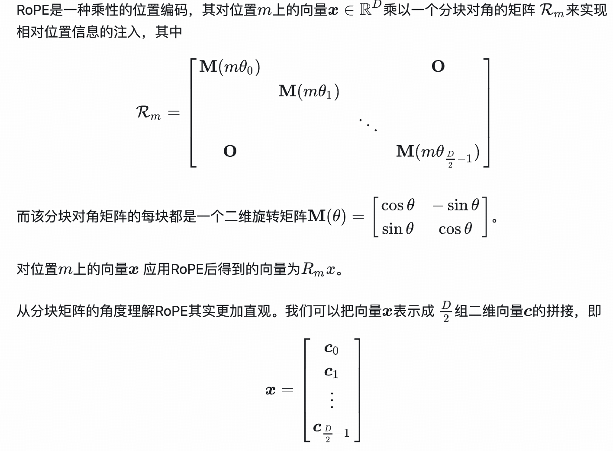

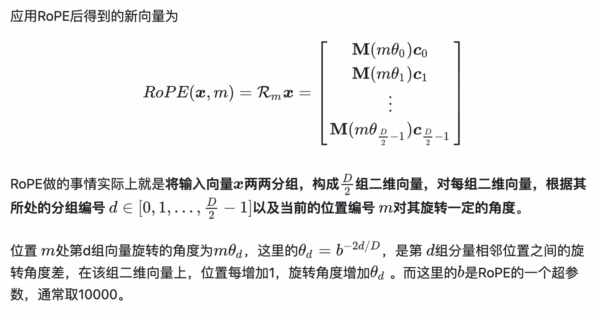

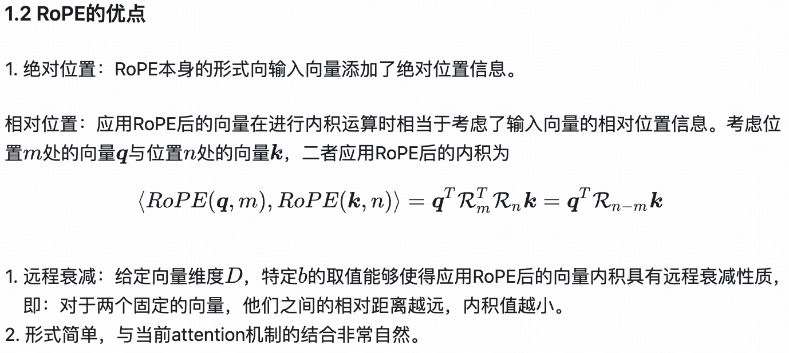

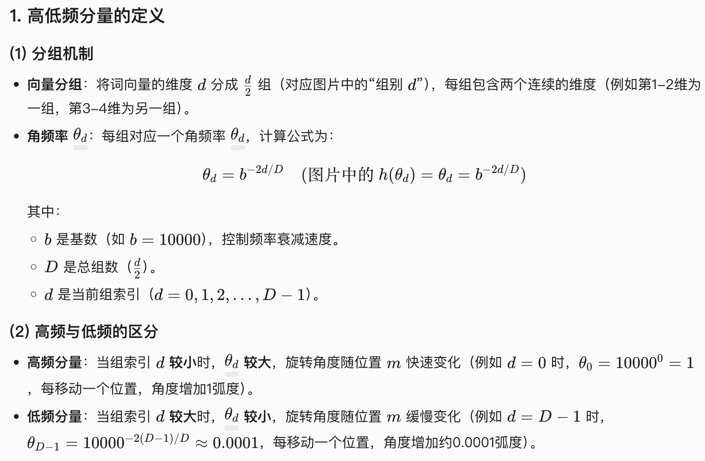

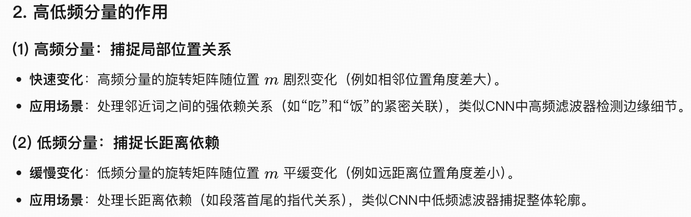

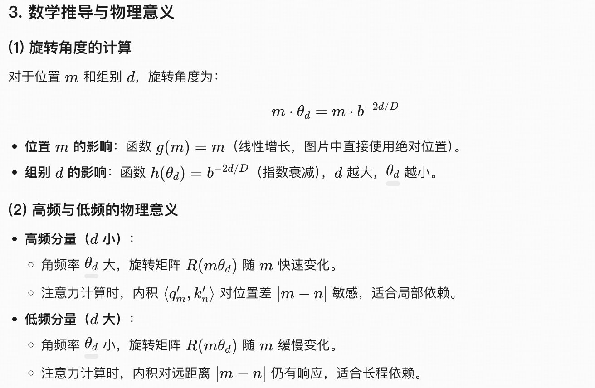

组别越小，角速率theta越大，转动角度越大，高频，捕捉局部关系

组别越大，角速率theta越小，转动角度越小，低频，捕捉长上下文关系


# 归一化Norm
## 内部协变量偏移（Internal Covariate Shift, ICS）
在深度神经网络训练过程中，**每一层的输入分布会因参数更新而发生动态变化**，这种现象被称为内部协变量偏移（ICS）。具体来说，当网络参数通过梯度下降更新时，前一层的权重调整会导致后一层的输入分布（如均值、方差）持续改变，这种变化在深层网络中会被逐层放大，使得高层需要不断适应底层的分布变化

### ICS带来的问题
**训练效率下降  
**	输入分布不稳定时，模型需要频繁调整学习率：学习率过大会导致梯度爆炸，过小则收敛缓慢。  
高层网络需不断适应底层输入的分布变化，导致参数更新方向反复调整，延长收敛时间。

  
**梯度消失或爆炸**  
	输入分布变化可能使激活函数进入饱和区（如Sigmoid的极端值区域），导致梯度趋近于零（梯度消失）或数值溢出（梯度爆炸）。

## Layer Norm
针对一个样本内不同token的所有特征进行归一化

Norm的作用是为了缓解ICS


## Batch Norm
针对一批样本中同一个位置的token，对所有特征进行归一化


## swish


## swiglu


## gelu
# 推理
## 采样
温度

+ **与 Top-K/Top-P 结合 **：  
温度通常与 Top-K（限制候选词数量）或 Top-P（限制累积概率）联合使用。例如：
    - **低温度 + Top-K=5 **：在少量候选词中选择最可能的结果，适合高确定性任务1012。
    - **高温度 + Top-P=0.9 **：在高概率词集中引入多样性，适合创意生成69。

